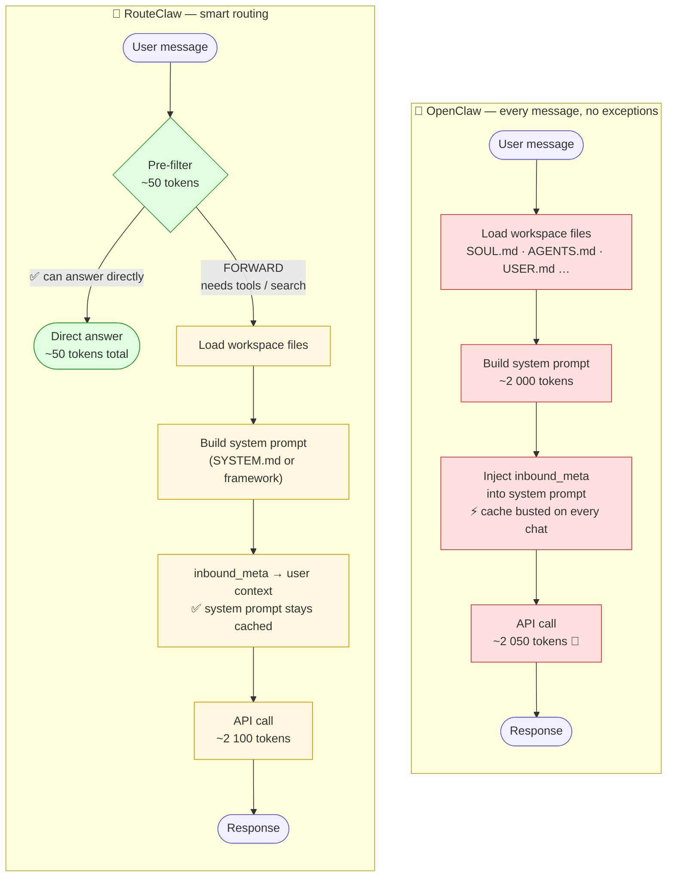

# RouteClaw

> OpenClaw with smart pre-filter routing — answer simple questions in ~50 tokens instead of 2 000+.

RouteClaw is a drop-in fork of [OpenClaw](https://github.com/openclaw/openclaw) (MIT) that fixes the gateway's biggest inefficiency: a ~2 000-token system prompt was sent on **every single message**, including "hi" and heartbeat pings.

[](https://www.npmjs.com/package/routeclaw)
[](LICENSE)
[](https://github.com/globalldev/routeclaw)

---

## How a request travels — OpenClaw vs RouteClaw



**Simple message** ("hi", "what is 2+2?") — RouteClaw short-circuits at the pre-filter and never touches workspace files or history.
**Complex message** ("search for latest AI news") — goes through `FORWARD` and runs the full pipeline, same as OpenClaw.

---

## Token benchmark

| Message | OpenClaw | RouteClaw | Saving |
|---------|:--------:|:---------:|:------:|
| "привет" | ~2 050 | ~50 | **97 %** |
| "what is DNS?" | ~2 050 | ~200 | **90 %** |
| "find latest AI news" | ~2 050 | ~2 100 * | 0 % |

\* Complex requests run the full pipeline — same cost as upstream.

---

## What RouteClaw adds

### 1 · Pre-filter agent

Before loading any workspace files, tools, or history, RouteClaw makes a tiny API call with a single-sentence system prompt:

- Can answer from knowledge → **replies directly** (~50 tokens total)
- Needs tools, search, or context → sends `FORWARD`, full pipeline runs normally

Applies only to the `g1` entry agent. Everything else is unchanged.

### 2 · Inbound metadata moved to user context

`inbound_meta` (chat ID, account ID, channel type, etc.) was previously injected into the **system prompt**, busting prefix caches on every new chat. RouteClaw moves it to the **user context** so the system prompt stays static and providers can cache it.

### 3 · All prompts configurable via Markdown files

No hardcoded text anywhere in JS/TS — every prompt is a `.md` file:

| File | Controls |
|------|----------|
| `~/.openclaw/prefilter-g1.md` | Pre-filter system prompt (hot-reloaded every 30 s) |
| `<workspace>/SYSTEM.md` | Full agent base prompt — replaces the ~2 000-token boilerplate |
| `<workspace>/AGENTS.md` | Agent routing rules |
| `<workspace>/SOUL.md` | Personality / tone |
| `<workspace>/IDENTITY.md` | Identity |

---

## Install

```bash
# Fresh install
npm install -g routeclaw

# Both CLI aliases work — same binary
routeclaw gateway start
openclaw gateway start
```

### Migrate from OpenClaw

```bash
npm uninstall -g openclaw
npm install -g routeclaw
# All ~/.openclaw/* config and workspace files are preserved
```

---

## Configure the pre-filter prompt

Create `~/.openclaw/prefilter-g1.md` (hot-reloaded every 30 s, no restart needed):

```
Answer the user's question if you can do it without external sources of information
(internet, local data, etc.).
If you cannot — reply with exactly one word: FORWARD
```

The file is auto-created with the default content on first run.

---

## Replace the full agent system prompt

Create `SYSTEM.md` in your workspace directory
(e.g. `~/.openclaw/workspace-g1-worker/SYSTEM.md`):

```markdown
You are a capable AI assistant with access to tools: web search, file operations, and code execution.

Route complex tasks to specialists when needed:
- Search/research tasks → spawn agent `g2`
- Code/programming tasks → spawn agent `g3`
- Handle everything else directly using available tools.

Be concise and direct. Use tools when needed, not by default.
```

This **fully replaces** the ~2 000-token framework boilerplate. Bootstrap files (AGENTS.md, SOUL.md, etc.) are still appended after it.

---

## Staying up to date with upstream

```bash
git remote add upstream https://github.com/openclaw/openclaw
git fetch upstream
git rebase upstream/main
pnpm build
```

Conflicts only ever happen in 3 source files:
`prefilter.ts` · `get-reply.ts` · `inbound-meta.ts`

---

## Full documentation

For channels, skills, onboarding, Docker, and everything else — see the upstream [OpenClaw docs](https://docs.openclaw.ai).
RouteClaw is 100 % compatible: same config format, same workspace layout, same CLI commands.

> 🇷🇺 [Читать на русском](README.ru.md)

---

## License

MIT — same as OpenClaw upstream.
