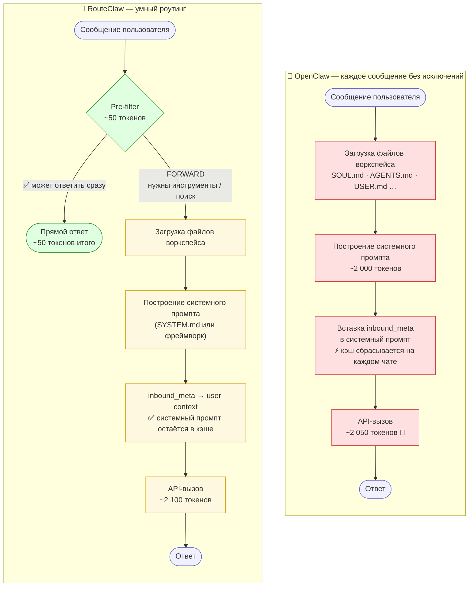

# RouteClaw

> OpenClaw с умным pre-filter роутингом — отвечает на простые вопросы в ~50 токенов вместо 2 000+.

RouteClaw — это форк [OpenClaw](https://github.com/openclaw/openclaw) (MIT), который устраняет главную неэффективность шлюза: системный промпт на ~2 000 токенов отправлялся при **каждом сообщении**, включая "привет" и heartbeat-пинги.

[](https://www.npmjs.com/package/routeclaw)
[](LICENSE)
[](https://github.com/globalldev/routeclaw)

---

## Путь запроса — OpenClaw vs RouteClaw



**Простое сообщение** ("привет", "сколько будет 2+2?") — RouteClaw отвечает на уровне pre-filter, не трогая файлы воркспейса и историю.
**Сложное сообщение** ("найди последние новости об ИИ") — идёт через `FORWARD` и запускает полный pipeline, как в OpenClaw.

---

## Бенчмарк токенов

| Сообщение | OpenClaw | RouteClaw | Экономия |
|-----------|:--------:|:---------:|:--------:|
| "привет" | ~2 050 | ~50 | **97 %** |
| "что такое DNS?" | ~2 050 | ~200 | **90 %** |
| "найди новости об ИИ" | ~2 050 | ~2 100 * | 0 % |

\* Сложные запросы проходят полный pipeline — такая же стоимость, как в upstream.

---

## Что добавляет RouteClaw

### 1 · Pre-filter агент

До загрузки файлов воркспейса, инструментов или истории RouteClaw делает маленький API-вызов с однострочным системным промптом:

- Может ответить из знаний → **отвечает напрямую** (~50 токенов итого)
- Нужны инструменты, поиск или контекст → отправляет `FORWARD`, запускается полный pipeline

Применяется только к агенту `g1`. Всё остальное без изменений.

### 2 · Метаданные перенесены в user context

`inbound_meta` (chat ID, account ID, тип канала и т.д.) раньше вставлялась в **системный промпт**, сбрасывая prefix-кэш при каждом новом чате. RouteClaw переносит её в **user context** — системный промпт остаётся статичным и кэшируется провайдером между сообщениями.

### 3 · Все промпты настраиваются через Markdown-файлы

Никакого hardcoded текста в JS/TS — каждый промпт это `.md` файл:

| Файл | Управляет |
|------|-----------|
| `~/.openclaw/prefilter-g1.md` | Системный промпт pre-filter (горячая перезагрузка каждые 30 с) |
| `<workspace>/SYSTEM.md` | Базовый промпт агента — полностью заменяет ~2 000-токенный шаблон фреймворка |
| `<workspace>/AGENTS.md` | Правила роутинга агентов |
| `<workspace>/SOUL.md` | Личность / тон |
| `<workspace>/IDENTITY.md` | Идентичность |

---

## Установка

```bash
# Новая установка
npm install -g routeclaw

# Оба CLI-псевдонима работают — один бинарник
routeclaw gateway start
openclaw gateway start
```

### Миграция с OpenClaw

```bash
npm uninstall -g openclaw
npm install -g routeclaw
# Все файлы ~/.openclaw/* сохраняются
```

---

## Настройка промпта pre-filter

Создайте `~/.openclaw/prefilter-g1.md` (горячая перезагрузка каждые 30 с, рестарт не нужен):

```
Ответь на вопрос пользователя, если можешь сделать это без дополнительных
источников информации: интернета, локальных данных и т.д.
Отвечай кратко и по делу.
Если не можешь — ответь ровно одним словом: FORWARD
```

Файл создаётся автоматически с содержимым по умолчанию при первом запуске.

---

## Замена полного системного промпта агента

Создайте `SYSTEM.md` в директории воркспейса
(например `~/.openclaw/workspace-g1-worker/SYSTEM.md`):

```markdown
You are a capable AI assistant with access to tools: web search, file operations, and code execution.

Route complex tasks to specialists when needed:
- Search/research tasks → spawn agent `g2`
- Code/programming tasks → spawn agent `g3`
- Handle everything else directly using available tools.

Be concise and direct. Use tools when needed, not by default.
```

Это **полностью заменяет** ~2 000-токенный шаблон фреймворка. Bootstrap-файлы (AGENTS.md, SOUL.md и т.д.) по-прежнему добавляются после него.

---

## Обновление вместе с upstream

```bash
git remote add upstream https://github.com/openclaw/openclaw
git fetch upstream
git rebase upstream/main
pnpm build
```

Конфликты возникают только в 3 файлах:
`prefilter.ts` · `get-reply.ts` · `inbound-meta.ts`

---

## Полная документация

По каналам, скиллам, онбордингу, Docker и всему остальному — документация upstream [OpenClaw](https://docs.openclaw.ai).
RouteClaw полностью совместим: тот же формат конфигов, та же структура воркспейса, те же CLI-команды.

> 🇬🇧 [Read in English](README.md)

---

## Лицензия

MIT — как и в upstream OpenClaw.
